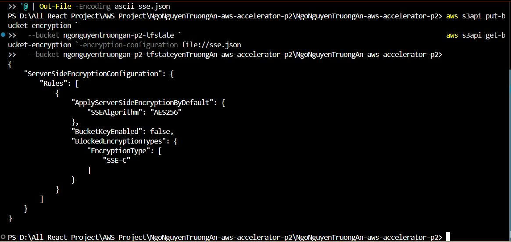
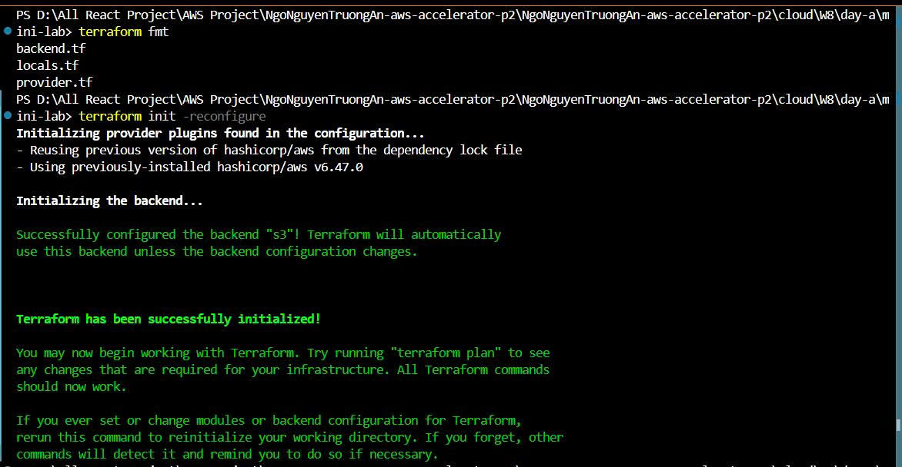
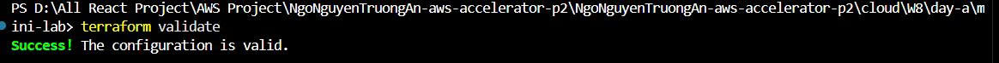
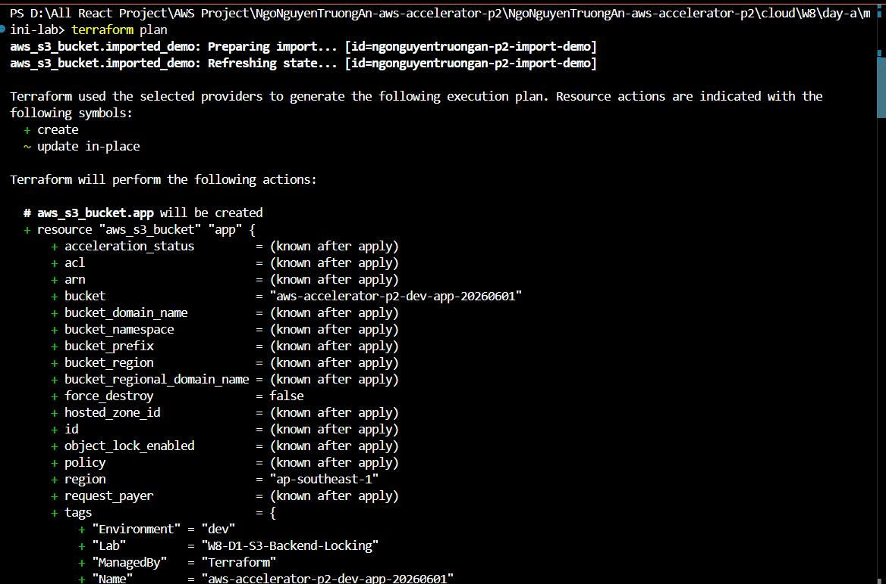
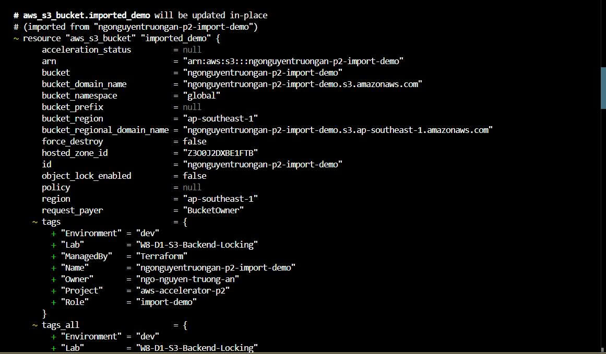
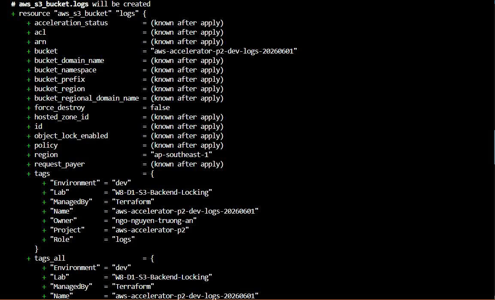
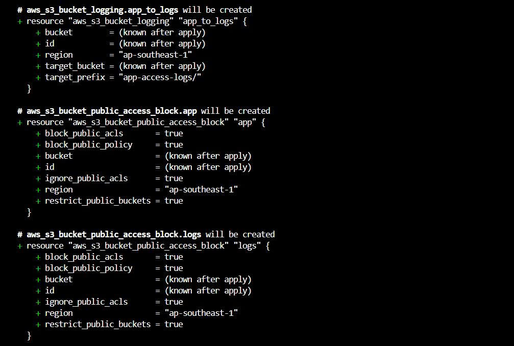
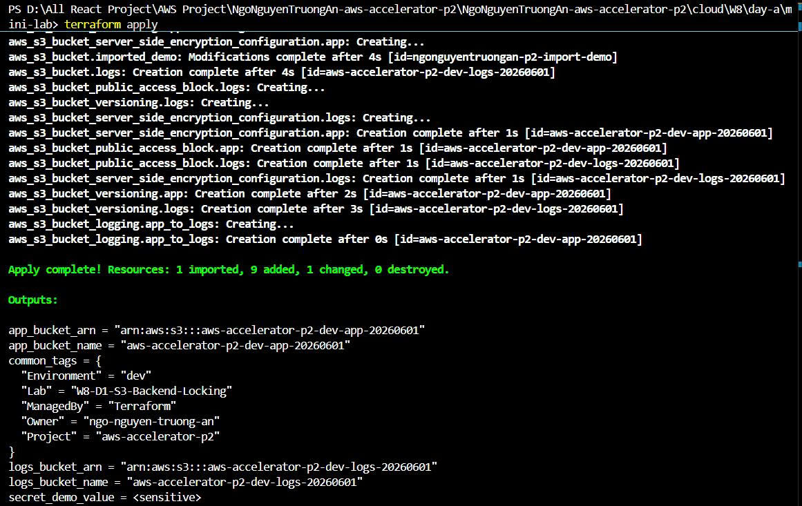
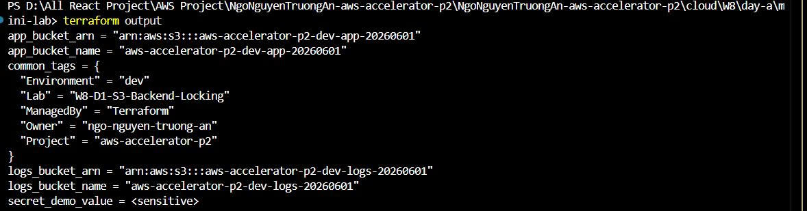
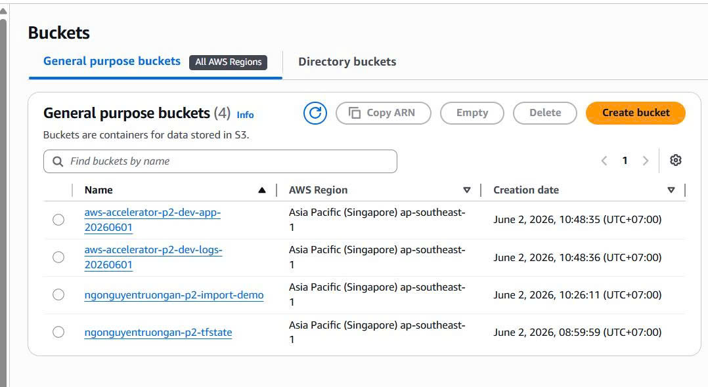

## Mini-lap 

## Backend.tf
- Trong backend.tf, em cấu hình Terraform block để định nghĩa backend S3, required_version và required_providers.
- Backend S3 giúp Terraform lưu state từ xa trên S3 thay vì lưu local. Em dùng bucket để chỉ định nơi lưu state, key để chỉ định đường dẫn file state trong bucket, region để chỉ định region của bucket, encrypt để mã hóa state và use_lockfile = true để bật S3 native state locking.
[Backend.tf](./backend.tf)
## Tạo S3 bucket backend
**Lưu ý nhớ cung cấp quyền để có thể tạo được nha mn**
- Tạo S3 backend bucket băng CLI:

- Bật versioning

- Bật encryption bằng file JSON
+ Tạo file sse.json:
[sse.json](../../../../sse.json)
+ Bật encryption

## local.tf
- Mục tiêu của locals.tf là: tạo các giá trị nội bộ dùng lại nhiều lần trong Terraform code, để bạn không phải lặp chuỗi tên bucket, tags, prefix ở nhiều file
[local.tf](./locals.tf)

## main.tf
- main.tf là phần tạo resource thật trên AWS. Trong lab này, main.tf sẽ tạo:
1. S3 bucket app
2. S3 bucket logs
3. Versioning cho 2 bucket
4. Encryption cho 2 bucket
5. Public access block cho 2 bucket
6. Logging từ app bucket sang logs bucket
[main.tf](./main.tf)
## outputs.tf
- Trong `outputs.tf`,khai báo các output values để hiển thị thông tin quan trọng sau khi Terraform apply.
- Các output giúp kiểm tra nhanh tên bucket, ARN bucket, common tags và sensitive output.
## import.tf
- File `import.tf` dùng để chứng minh cách import một resource đã tồn tại ngoài Terraform vào Terraform state.
- Trong lab này, tạo trước một S3 bucket bằng AWS CLI, sau đó dùng import block để đưa bucket đó vào Terraform state.

- Import block không tạo resource mới. Nó chỉ map resource thật trên AWS vào địa chỉ resource trong Terraform code.
[import.tf](./import.tf)
**Lưu ý mn bổ sung khai báo trong main.tf**

## Chạy lệnh Terraform
1. terraform fmt và terraform init -reconfigure

2. terraform validate 

3. terraform plan

4. terraform apply

5. terraform state list

6. terraform output

**Evidence**: các bucket đã được tạo
